# Titanic Survival Prediction


The sinking of the Titanic is one of the most infamous shipwrecks in history. On April 15, 1912, during her maiden voyage, the widely considered “unsinkable” RMS Titanic sank after colliding with an iceberg. Unfortunately, there weren’t enough lifeboats for everyone onboard, resulting in the death of 1502 out of 2224 passengers and crew. While there was some element of luck involved in surviving, it seems some groups of people were more likely to survive than others. In this challenge, we are building a predictive model that answers the question: “what sorts of people were more likely to survive?” using passenger data (ie name, age, gender, socio-economic class, etc).

    Content of the Code

    1. Loading Data
    2. Analysing the Data
    3. Feature Engineering
    4. KNN ML Model
    5. Logistic Regression ML Model
    6. Prediction


**CODE**


#Importing basic libraries and loading data sets


```python
import pandas as pd
import numpy as np
import seaborn as sns
import matplotlib.pyplot as plt
import math
%matplotlib inline

# To manage ticker in plot
from matplotlib.ticker import MaxNLocator
```
Here we are importing important libraries like pandas to create dataframe, numpy for execution of mathematical functions on array, and seaborn & matplotlib for plotting data.

```python
train_data=pd.read_csv('/Users/sam/Documents/ML/train.csv')
train_data.head(5)
```


<div>

<table border="1" class="dataframe">
  <thead>
    <tr style="text-align: right;">
      <th></th>
      <th>PassengerId</th>
      <th>Survived</th>
      <th>Pclass</th>
      <th>Name</th>
      <th>Sex</th>
      <th>Age</th>
      <th>SibSp</th>
      <th>Parch</th>
      <th>Ticket</th>
      <th>Fare</th>
      <th>Cabin</th>
      <th>Embarked</th>
    </tr>
  </thead>
  <tbody>
    <tr>
      <th>0</th>
      <td>1</td>
      <td>0</td>
      <td>3</td>
      <td>Braund, Mr. Owen Harris</td>
      <td>male</td>
      <td>22.0</td>
      <td>1</td>
      <td>0</td>
      <td>A/5 21171</td>
      <td>7.2500</td>
      <td>NaN</td>
      <td>S</td>
    </tr>
    <tr>
      <th>1</th>
      <td>2</td>
      <td>1</td>
      <td>1</td>
      <td>Cumings, Mrs. John Bradley (Florence Briggs Th...</td>
      <td>female</td>
      <td>38.0</td>
      <td>1</td>
      <td>0</td>
      <td>PC 17599</td>
      <td>71.2833</td>
      <td>C85</td>
      <td>C</td>
    </tr>
    <tr>
      <th>2</th>
      <td>3</td>
      <td>1</td>
      <td>3</td>
      <td>Heikkinen, Miss. Laina</td>
      <td>female</td>
      <td>26.0</td>
      <td>0</td>
      <td>0</td>
      <td>STON/O2. 3101282</td>
      <td>7.9250</td>
      <td>NaN</td>
      <td>S</td>
    </tr>
    <tr>
      <th>3</th>
      <td>4</td>
      <td>1</td>
      <td>1</td>
      <td>Futrelle, Mrs. Jacques Heath (Lily May Peel)</td>
      <td>female</td>
      <td>35.0</td>
      <td>1</td>
      <td>0</td>
      <td>113803</td>
      <td>53.1000</td>
      <td>C123</td>
      <td>S</td>
    </tr>
    <tr>
      <th>4</th>
      <td>5</td>
      <td>0</td>
      <td>3</td>
      <td>Allen, Mr. William Henry</td>
      <td>male</td>
      <td>35.0</td>
      <td>0</td>
      <td>0</td>
      <td>373450</td>
      <td>8.0500</td>
      <td>NaN</td>
      <td>S</td>
    </tr>
  </tbody>
</table>
</div>


Here we are loading the datfiles.

```python
print('number of passenger in training data:'+str(len(train_data.index)))
```

    number of passenger in training data:891


```python
test_data=pd.read_csv('/Users/sam/Documents/ML/test.csv')
print('number of passenger in testing data:'+str(len(test_data.index)))
```

    number of passenger in testing data:418


#Analyzing Data 


```python
# Let pandas show all columns
pd.options.display.width = 0

# For better viusalisation increase horizontal space for subplots
plt.subplots_adjust(left=None, bottom=None, right=None, top=None, wspace=None, hspace=0.4)

# Seaborn theme setings
sns.set_theme(style = "whitegrid", palette="deep")
```


    <Figure size 432x288 with 0 Axes>


Now we will merge both testing and training data to analyze the correlation between the features.

```python
#merging training and testing data for missing values imputation
len_train=len(train_data)
data_all=pd.concat(objs=[train_data,test_data],axis=0).reset_index(drop=True)
data_all.info()
print('number of passenger in all data:'+str(len(data_all.index)))
data_all.head()
```

    <class 'pandas.core.frame.DataFrame'>
    RangeIndex: 1309 entries, 0 to 1308
    Data columns (total 12 columns):
     #   Column       Non-Null Count  Dtype  
    ---  ------       --------------  -----  
     0   PassengerId  1309 non-null   int64  
     1   Survived     891 non-null    float64
     2   Pclass       1309 non-null   int64  
     3   Name         1309 non-null   object 
     4   Sex          1309 non-null   object 
     5   Age          1046 non-null   float64
     6   SibSp        1309 non-null   int64  
     7   Parch        1309 non-null   int64  
     8   Ticket       1309 non-null   object 
     9   Fare         1308 non-null   float64
     10  Cabin        295 non-null    object 
     11  Embarked     1307 non-null   object 
    dtypes: float64(3), int64(4), object(5)
    memory usage: 122.8+ KB
    number of passenger in all data:1309


<div>
<table border="1" class="dataframe">
  <thead>
    <tr style="text-align: right;">
      <th></th>
      <th>PassengerId</th>
      <th>Survived</th>
      <th>Pclass</th>
      <th>Name</th>
      <th>Sex</th>
      <th>Age</th>
      <th>SibSp</th>
      <th>Parch</th>
      <th>Ticket</th>
      <th>Fare</th>
      <th>Cabin</th>
      <th>Embarked</th>
    </tr>
  </thead>
  <tbody>
    <tr>
      <th>0</th>
      <td>1</td>
      <td>0.0</td>
      <td>3</td>
      <td>Braund, Mr. Owen Harris</td>
      <td>male</td>
      <td>22.0</td>
      <td>1</td>
      <td>0</td>
      <td>A/5 21171</td>
      <td>7.2500</td>
      <td>NaN</td>
      <td>S</td>
    </tr>
    <tr>
      <th>1</th>
      <td>2</td>
      <td>1.0</td>
      <td>1</td>
      <td>Cumings, Mrs. John Bradley (Florence Briggs Th...</td>
      <td>female</td>
      <td>38.0</td>
      <td>1</td>
      <td>0</td>
      <td>PC 17599</td>
      <td>71.2833</td>
      <td>C85</td>
      <td>C</td>
    </tr>
    <tr>
      <th>2</th>
      <td>3</td>
      <td>1.0</td>
      <td>3</td>
      <td>Heikkinen, Miss. Laina</td>
      <td>female</td>
      <td>26.0</td>
      <td>0</td>
      <td>0</td>
      <td>STON/O2. 3101282</td>
      <td>7.9250</td>
      <td>NaN</td>
      <td>S</td>
    </tr>
    <tr>
      <th>3</th>
      <td>4</td>
      <td>1.0</td>
      <td>1</td>
      <td>Futrelle, Mrs. Jacques Heath (Lily May Peel)</td>
      <td>female</td>
      <td>35.0</td>
      <td>1</td>
      <td>0</td>
      <td>113803</td>
      <td>53.1000</td>
      <td>C123</td>
      <td>S</td>
    </tr>
    <tr>
      <th>4</th>
      <td>5</td>
      <td>0.0</td>
      <td>3</td>
      <td>Allen, Mr. William Henry</td>
      <td>male</td>
      <td>35.0</td>
      <td>0</td>
      <td>0</td>
      <td>373450</td>
      <td>8.0500</td>
      <td>NaN</td>
      <td>S</td>
    </tr>
  </tbody>
</table>
</div>


We will check the missing data of the features so that we can use those features to predict.


```python
#check missing data
null_data=data_all.isnull().sum()
null_data[null_data>0]
```


    Survived     418
    Age          263
    Fare           1
    Cabin       1014
    Embarked       2
    dtype: int64


We will be converting some features into categorical data.


```python
#Converting some columns to categories and category labels to discrete numbers
data_all["Cabin_Group"] = data_all["Cabin"].str[:1]
data_all["Cabin_Group"] = data_all["Cabin_Group"].astype('category')
cabin_group_categories = dict(enumerate(data_all["Cabin_Group"].cat.categories))

data_all["Cabin_Group"] = data_all["Cabin_Group"].cat.codes
data_all["Cabin_Group"] = data_all["Cabin_Group"].astype(int)

data_all["Sex"] = data_all["Sex"].astype('category')
sex_categories = dict(enumerate(data_all["Sex"].cat.categories))
data_all["Sex"] = data_all["Sex"].cat.codes
data_all["Sex"] = data_all["Sex"].astype(int)

data_all["Embarked"] = data_all["Embarked"].astype('category')
embarked_categories = dict(enumerate(data_all["Embarked"].cat.categories))
data_all["Embarked"] = data_all["Embarked"].cat.codes
data_all["Embarked"] = data_all["Embarked"].astype(int)

data_all = data_all.convert_dtypes()
data_all.info()
```

    <class 'pandas.core.frame.DataFrame'>
    RangeIndex: 1309 entries, 0 to 1308
    Data columns (total 13 columns):
     #   Column       Non-Null Count  Dtype  
    ---  ------       --------------  -----  
     0   PassengerId  1309 non-null   Int64  
     1   Survived     891 non-null    Int64  
     2   Pclass       1309 non-null   Int64  
     3   Name         1309 non-null   string 
     4   Sex          1309 non-null   Int64  
     5   Age          1046 non-null   Float64
     6   SibSp        1309 non-null   Int64  
     7   Parch        1309 non-null   Int64  
     8   Ticket       1309 non-null   string 
     9   Fare         1308 non-null   Float64
     10  Cabin        295 non-null    string 
     11  Embarked     1309 non-null   Int64  
     12  Cabin_Group  1309 non-null   Int64  
    dtypes: Float64(2), Int64(8), string(3)
    memory usage: 145.9 KB


```python
print('\nEmbarked:')
print(embarked_categories)
print('\nCabin Group:')
print(cabin_group_categories)
print('\nSex:')
print(sex_categories)
```

    
    Embarked:
    {0: 'C', 1: 'Q', 2: 'S'}
    
    Cabin Group:
    {0: 'A', 1: 'B', 2: 'C', 3: 'D', 4: 'E', 5: 'F', 6: 'G', 7: 'T'}
    
    Sex:
    {0: 'female', 1: 'male'}


PLOTS and imputing missing data


```python
#fare
fig,axes = plt.subplots(nrows=3, ncols=3, figsize=(15,15))

axes[0,0].xaxis.set_major_locator(MaxNLocator(integer=True))
axes[0,1].yaxis.set_major_locator(MaxNLocator(integer=True))
axes[0,2].yaxis.set_major_locator(MaxNLocator(integer=True))
axes[2,2].yaxis.set_major_locator(MaxNLocator(integer=True))

sns.histplot(ax=axes[0,0], data=data_all, x="Fare")
sns.scatterplot(ax=axes[0,1], data=data_all, x="Fare", y="Survived")
sns.scatterplot(ax=axes[0,2], data=data_all, x="Fare", y="Pclass")
sns.scatterplot(ax=axes[1,0], data=data_all, x="Fare", y="Age")
sns.scatterplot(ax=axes[1,1], data=data_all, x="Fare", y="Sex")
sns.scatterplot(ax=axes[1,2], data=data_all, x="Fare", y="SibSp")
sns.scatterplot(ax=axes[2,0], data=data_all, x="Fare", y="Parch")
sns.scatterplot(ax=axes[2,1], data=data_all, x="Fare", y="Cabin_Group")
sns.scatterplot(ax=axes[2,2], data=data_all, x="Fare", y="Embarked")

plt.show()
```


    
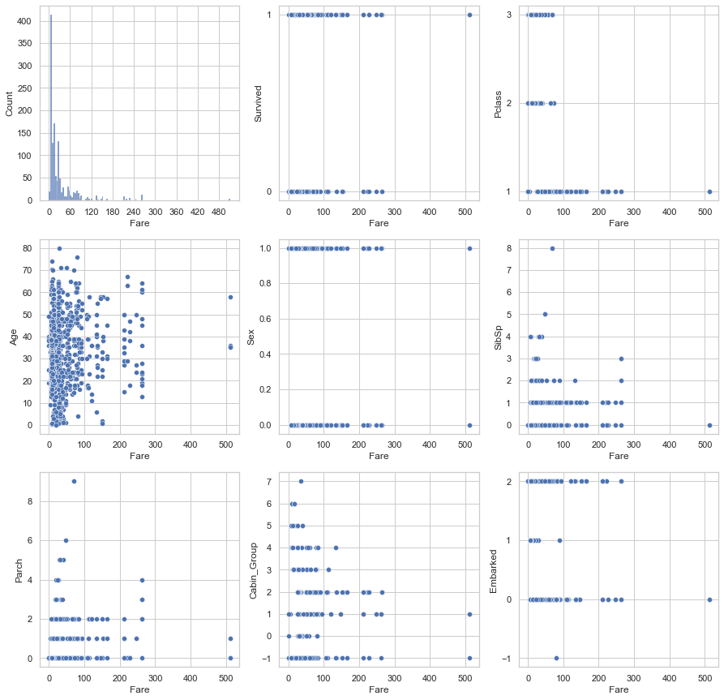
    


```python
#checking the one missing fare data
data_all[data_all["Fare"].isnull()]
```


<div>
<table border="1" class="dataframe">
  <thead>
    <tr style="text-align: right;">
      <th></th>
      <th>PassengerId</th>
      <th>Survived</th>
      <th>Pclass</th>
      <th>Name</th>
      <th>Sex</th>
      <th>Age</th>
      <th>SibSp</th>
      <th>Parch</th>
      <th>Ticket</th>
      <th>Fare</th>
      <th>Cabin</th>
      <th>Embarked</th>
      <th>Cabin_Group</th>
    </tr>
  </thead>
  <tbody>
    <tr>
      <th>1043</th>
      <td>1044</td>
      <td>&lt;NA&gt;</td>
      <td>3</td>
      <td>Storey, Mr. Thomas</td>
      <td>1</td>
      <td>60.5</td>
      <td>0</td>
      <td>0</td>
      <td>3701</td>
      <td>&lt;NA&gt;</td>
      <td>&lt;NA&gt;</td>
      <td>2</td>
      <td>-1</td>
    </tr>
  </tbody>
</table>
</div>


```python
#filling the one missing fare data
m = data_all[data_all["Pclass"]==3]["Fare"].median()
data_all["Fare"] = data_all["Fare"].fillna(m)
```


```python
#embarked 
fig,axes = plt.subplots(nrows=3, ncols=3, figsize=(15,15))

# Make ticks integer for discrete values
axes[0,0].xaxis.set_major_locator(MaxNLocator(integer=True))
axes[0,1].yaxis.set_major_locator(MaxNLocator(integer=True))
axes[0,2].yaxis.set_major_locator(MaxNLocator(integer=True))
axes[1,0].yaxis.set_major_locator(MaxNLocator(integer=True))

sns.histplot(ax=axes[0,0], data=data_all, x="Embarked")
sns.boxplot(ax=axes[0,1], data=data_all, x="Embarked",y="Survived")
sns.boxplot(ax=axes[0,2], data=data_all, x="Embarked",y="Pclass")
sns.boxplot(ax=axes[1,0], data=data_all, x="Embarked",y="Sex")
sns.boxplot(ax=axes[1,1], data=data_all, x="Embarked",y="Age")
sns.boxplot(ax=axes[1,2], data=data_all, x="Embarked",y="SibSp")
sns.boxplot(ax=axes[2,0], data=data_all, x="Embarked",y="Parch")
sns.boxplot(ax=axes[2,1], data=data_all, x="Embarked",y="Fare")
sns.boxplot(ax=axes[2,2], data=data_all, x="Embarked",y="Cabin_Group")

plt.show()
```


    
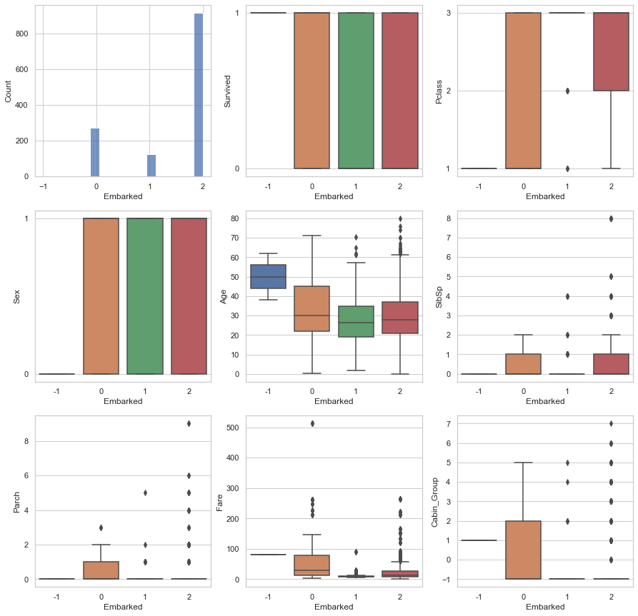
    


```python
#checking missing embarked values
data_all[data_all["Embarked"]==-1]
```


<div>
<table border="1" class="dataframe">
  <thead>
    <tr style="text-align: right;">
      <th></th>
      <th>PassengerId</th>
      <th>Survived</th>
      <th>Pclass</th>
      <th>Name</th>
      <th>Sex</th>
      <th>Age</th>
      <th>SibSp</th>
      <th>Parch</th>
      <th>Ticket</th>
      <th>Fare</th>
      <th>Cabin</th>
      <th>Embarked</th>
      <th>Cabin_Group</th>
    </tr>
  </thead>
  <tbody>
    <tr>
      <th>61</th>
      <td>62</td>
      <td>1</td>
      <td>1</td>
      <td>Icard, Miss. Amelie</td>
      <td>0</td>
      <td>38.0</td>
      <td>0</td>
      <td>0</td>
      <td>113572</td>
      <td>80.0</td>
      <td>B28</td>
      <td>-1</td>
      <td>1</td>
    </tr>
    <tr>
      <th>829</th>
      <td>830</td>
      <td>1</td>
      <td>1</td>
      <td>Stone, Mrs. George Nelson (Martha Evelyn)</td>
      <td>0</td>
      <td>62.0</td>
      <td>0</td>
      <td>0</td>
      <td>113572</td>
      <td>80.0</td>
      <td>B28</td>
      <td>-1</td>
      <td>1</td>
    </tr>
  </tbody>
</table>
</div>


Fare column shows us Embarked is "C" and and Pclass column confirms it Also we see that Cabin Names start with B belongs to port 0 (= C) We can fill missing Embarked value with "0"

Most frequent embarkation point is 2(=S).

Pclass at embarkation point 1(=Q) is 3 with some outliers. Embarkation point 2(=S) majors on Pclass 2 and 3.

The people at embarkation point 1(=Q) are somewhat younger than the others. Also most of them possibly do not have a family.

The embarkation point 0(=C) mostly consists of families with children. In every Pclass, there are children.

The people at embarkation point 0(=C) pays more for tickets.

Cabin_Group 0(=A) and 1(=B) mostly uses embarkation point 0(=C)


```python
#imputing missing embarked values
data_all["Embarked"] = data_all["Embarked"].replace(-1,0)
```


```python
#cabin group
fig,axes = plt.subplots(nrows=3, ncols=3,figsize=(15,15))

axes[0,1].yaxis.set_major_locator(MaxNLocator(integer=True))
axes[0,2].yaxis.set_major_locator(MaxNLocator(integer=True))
axes[1,0].yaxis.set_major_locator(MaxNLocator(integer=True))
axes[2,2].yaxis.set_major_locator(MaxNLocator(integer=True))

sns.histplot(ax=axes[0,0], data=data_all, x="Cabin_Group")
sns.boxplot(ax=axes[0,1], data=data_all, x="Cabin_Group", y="Survived")
sns.boxplot(ax=axes[0,2], data=data_all, x="Cabin_Group", y="Pclass")
sns.boxplot(ax=axes[1,0], data=data_all, x="Cabin_Group", y="Sex")
sns.boxplot(ax=axes[1,1], data=data_all, x="Cabin_Group", y="Age")
sns.boxplot(ax=axes[1,2], data=data_all, x="Cabin_Group", y="SibSp")
sns.boxplot(ax=axes[2,0], data=data_all, x="Cabin_Group", y="Parch")
sns.boxplot(ax=axes[2,1], data=data_all, x="Cabin_Group", y="Fare")
sns.boxplot(ax=axes[2,2], data=data_all, x="Cabin_Group", y="Embarked")

plt.show()
```


    
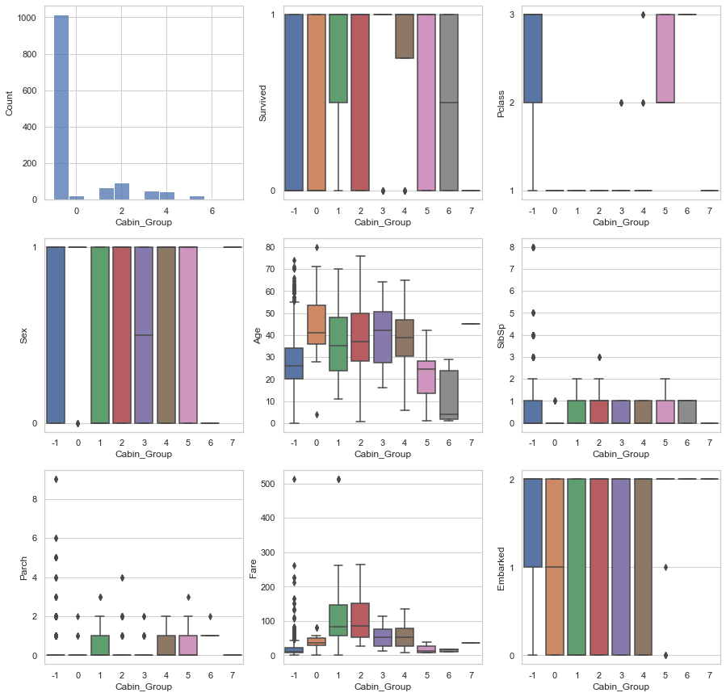
    


A high amount of Cabin_Group data is missing.

Except missing data: Cabin_Group 1(=B), 3(=D), 4(=E) was mostly survived and Cabin_Group 7(=T) did not survive.

Missing Cabin_Group data mostly belongs to Pclass 2 and 3. While Cabin_Group 5(=F) belongs to Pclass 2 and 3, it is 3 for Cabin_Group 6(=G)

People at Cabin_Group 0(=A) and 7(=T) is male, it is female for Cabin_Group 6(=G)

Age range is mostly 20-35 for missing Cabin_Group data.

Cabin_Group 0(=A) consists of older people. Young ones is at Cabin_Group 5(=F) and Cabin_Group 6(=G)

Except Cabin_Group 0(=A) and 7(=T), SibSp is not descriptive for Cabin_Group. It is similar for Parch.

People at Cabin_Group 2(=C) pays more for tickets.

Missing Cabin_Group data majors on embarkation point 2(=S)


```python
#imputing missing values in cabin group
missing_survived = len(data_all[(data_all['Cabin_Group']==-1) &(data_all["Survived"]==1)])
missing_not_survived = len(data_all[(data_all['Cabin_Group']==-1) &(data_all["Survived"]==0)])

cabin_null_count = len(data_all[(data_all['Cabin_Group']==-1)])
                               
print("Survived Percentage in Missing Cabin Values : ", '{:.0%}'.format(missing_survived / cabin_null_count))
print("Not-Survived Percentage in Missing Cabin Values : ", '{:.0%}'.format(missing_not_survived/ cabin_null_count))
```

    Survived Percentage in Missing Cabin Values :  20%
    Not-Survived Percentage in Missing Cabin Values :  47%


Since cabin_group gives good survival prediction so we will keep cabin_group and drop cabin


```python
data_all = data_all.drop(['Cabin'], axis=1)
```


```python
#age
fig,axes = plt.subplots(nrows=3, ncols=3, figsize=(15,15))

sns.histplot(ax=axes[0,0], data=data_all, x="Age",bins=10)
sns.boxplot(ax=axes[0,1], data=data_all, x="Pclass", y="Age")
sns.boxplot(ax=axes[0,2], data=data_all, x="Sex", y="Age")
sns.boxplot(ax=axes[1,0], data=data_all, x="SibSp", y="Age")
sns.boxplot(ax=axes[1,1], data=data_all, x="Parch", y="Age")
sns.scatterplot(ax=axes[1,2], data=data_all, x="Fare", y="Age")
sns.boxplot(ax=axes[2,0], data=data_all, x="Cabin_Group", y="Age")
sns.boxplot(ax=axes[2,1], data=data_all, x="Embarked", y="Age")
fig.delaxes(axes[2,2])

plt.show()
```


    
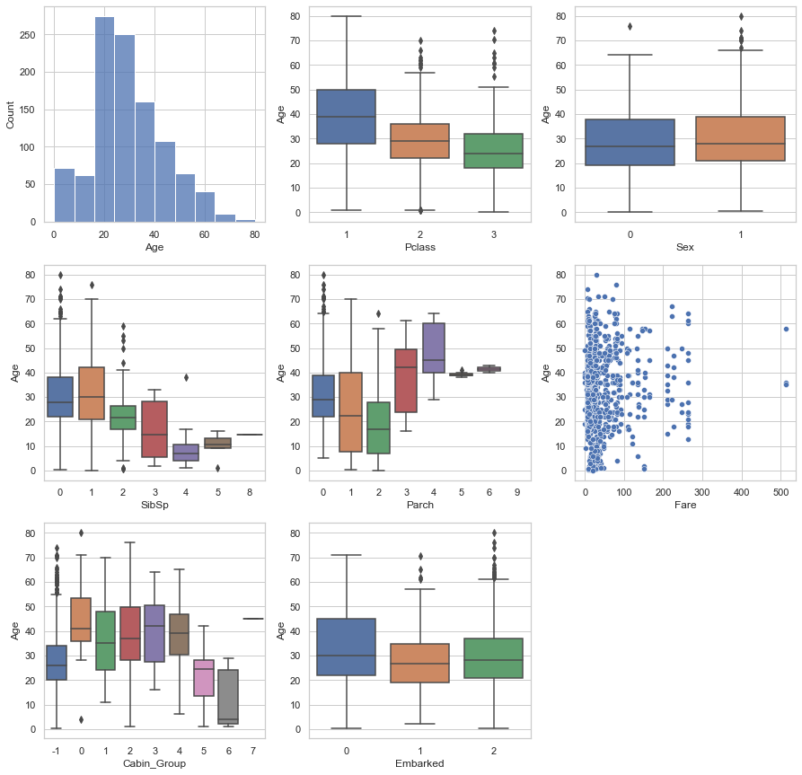
    


In the light of the above inspection we will use Pclass, SibSp, Parch, Cabin_Group, Survived and Embarked features to impute Age feature using decision tree.


```python
#imputing missing age
from sklearn.tree import DecisionTreeRegressor
from sklearn.experimental import enable_iterative_imputer
from sklearn.impute import IterativeImputer

data_impute_dtree = data_all.copy()
data_impute_dtree = data_impute_dtree.drop(["Name", "PassengerId","Ticket", "Sex","Fare"], axis=1)

dtr = DecisionTreeRegressor()
imp = IterativeImputer(estimator=dtr, missing_values=np.nan, max_iter=500, verbose=0, imputation_order='roman', random_state=42, min_value=0)
x_imputed = imp.fit_transform(data_impute_dtree)

data_impute_dtree["MF_Age"] = x_imputed[:,2]
data_impute_dtree["MF_Age"] = data_impute_dtree["MF_Age"].astype(int)
```


```python
#Pclass
fig,axes = plt.subplots(nrows=3, ncols=3, figsize=(15,15))

axes[0,0].xaxis.set_major_locator(MaxNLocator(integer=True))
axes[0,1].yaxis.set_major_locator(MaxNLocator(integer=True))
axes[0,2].yaxis.set_major_locator(MaxNLocator(integer=True))
axes[2,2].yaxis.set_major_locator(MaxNLocator(integer=True))

sns.histplot(ax=axes[0,0], data=data_all, x="Pclass")
sns.boxplot(ax=axes[0,1], data=data_all, x="Pclass", y="Survived")
sns.boxplot(ax=axes[0,2], data=data_all, x="Pclass", y="Sex")
sns.boxplot(ax=axes[1,0], data=data_all, x="Pclass", y="Age")
sns.boxplot(ax=axes[1,1], data=data_all, x="Pclass", y="SibSp")
sns.boxplot(ax=axes[1,2], data=data_all, x="Pclass", y="Parch")
sns.boxplot(ax=axes[2,0], data=data_all, x="Pclass", y="Fare")
sns.boxplot(ax=axes[2,1], data=data_all, x="Pclass", y="Cabin_Group")
sns.boxplot(ax=axes[2,2], data=data_all, x="Pclass", y="Embarked")

plt.show()
```


    
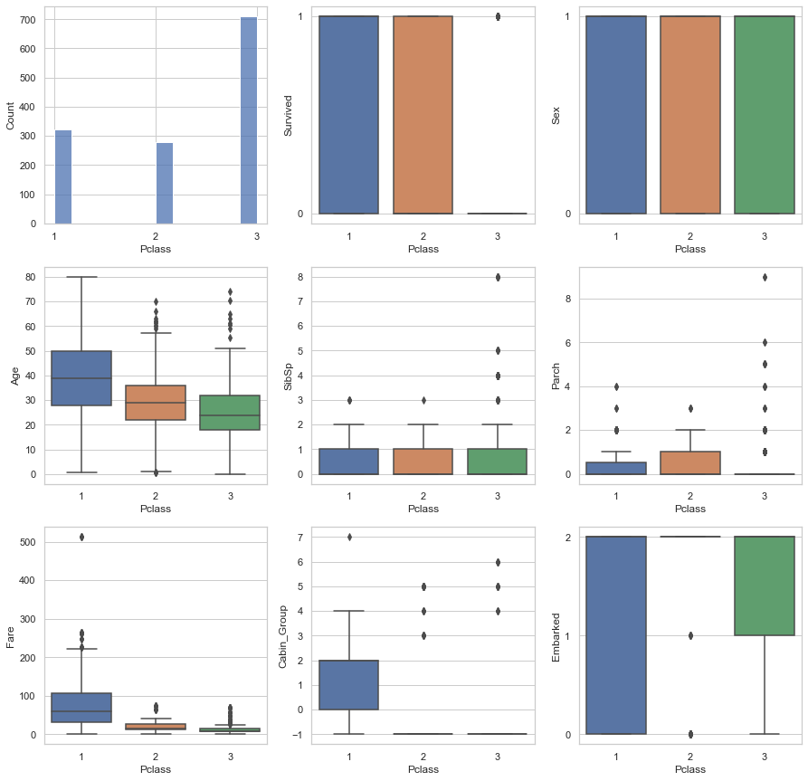
    


Pclass 3 mostly not survived.

Pclass 1 consists of older people. Younger people is at Pclass 3.

Families are mostly at Pclass 2.

Pclass 1 pays more for tickets.


```python
#sex vs others
fig,axes = plt.subplots(nrows=3, ncols=3, figsize=(15,15))

axes[0,0].xaxis.set_major_locator(MaxNLocator(integer=True))
axes[0,1].yaxis.set_major_locator(MaxNLocator(integer=True))
axes[0,2].yaxis.set_major_locator(MaxNLocator(integer=True))
axes[2,2].yaxis.set_major_locator(MaxNLocator(integer=True))

sns.histplot(ax=axes[0,0], data=data_all, x="Sex")
sns.boxplot(ax=axes[0,1], data=data_all, x="Sex", y="Survived")
sns.boxplot(ax=axes[0,2], data=data_all, x="Sex", y="Pclass")
sns.boxplot(ax=axes[1,0], data=data_all, x="Sex", y="Age")
sns.boxplot(ax=axes[1,1], data=data_all, x="Sex", y="SibSp")
sns.boxplot(ax=axes[1,2], data=data_all, x="Sex", y="Parch")
sns.boxplot(ax=axes[2,0], data=data_all, x="Sex", y="Fare")
sns.boxplot(ax=axes[2,1], data=data_all, x="Sex", y="Cabin_Group")
sns.boxplot(ax=axes[2,2], data=data_all, x="Sex", y="Embarked")

plt.show()

```


    
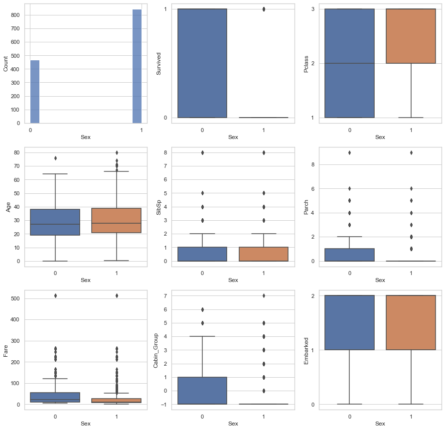
    


The number of men is (about) twice the number of women.

The female mostly survived.

Males major at Pclass 2 and 3.

Females are slightly younger.

Mostly females have Sibling/Spouse/Children.

Females pay more for tickets.

Females mostly embarked at 1(=2) and 2(=S)


```python
#SibSp(siblings or spouse on board)
fig,axes = plt.subplots(nrows=3, ncols=3, figsize=(15,15))

axes[0,0].xaxis.set_major_locator(MaxNLocator(integer=True))
axes[0,1].yaxis.set_major_locator(MaxNLocator(integer=True))
axes[1,1].yaxis.set_major_locator(MaxNLocator(integer=True))
axes[0,2].yaxis.set_major_locator(MaxNLocator(integer=True))
axes[2,2].yaxis.set_major_locator(MaxNLocator(integer=True))

sns.histplot(ax=axes[0,0], data=data_all, x="SibSp")
sns.boxplot(ax=axes[0,1], data=data_all, x="SibSp", y="Survived")
sns.boxplot(ax=axes[0,2], data=data_all, x="SibSp", y="Pclass")
sns.boxplot(ax=axes[1,0], data=data_all, x="SibSp", y="Age")
sns.boxplot(ax=axes[1,1], data=data_all, x="SibSp", y="Sex")
sns.boxplot(ax=axes[1,2], data=data_all, x="SibSp", y="Parch")
sns.boxplot(ax=axes[2,0], data=data_all, x="SibSp", y="Fare")
sns.boxplot(ax=axes[2,1], data=data_all, x="SibSp", y="Cabin_Group")
sns.boxplot(ax=axes[2,2], data=data_all, x="SibSp", y="Embarked")

plt.show()
```


    
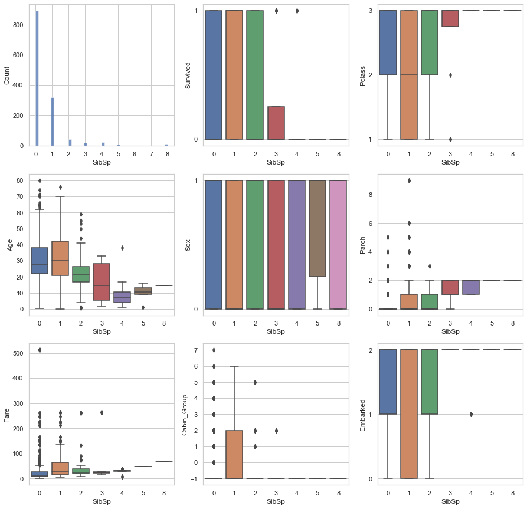
    


Most people have no sibling/spouse. If they have it is probably one.

More than 2 SibSp dramatically decreases survival possibility.

There are more survivors at PClass 1 (Middle aged, embarked at 1(=Q))

More than 2 sibling/spouse means you are young (The more siblings the less age.)


```python
#Parch(parents or children on board)
fig,axes = plt.subplots(nrows=3, ncols=3, figsize=(15,15))

axes[0,0].xaxis.set_major_locator(MaxNLocator(integer=True))
axes[0,1].yaxis.set_major_locator(MaxNLocator(integer=True))
axes[1,1].yaxis.set_major_locator(MaxNLocator(integer=True))
axes[0,2].yaxis.set_major_locator(MaxNLocator(integer=True))
axes[2,2].yaxis.set_major_locator(MaxNLocator(integer=True))

sns.histplot(ax=axes[0,0], data=data_all, x="Parch")
sns.boxplot(ax=axes[0,1], data=data_all, x="Parch", y="Survived")
sns.boxplot(ax=axes[0,2], data=data_all, x="Parch", y="Pclass")
sns.boxplot(ax=axes[1,0], data=data_all, x="Parch", y="Age")
sns.boxplot(ax=axes[1,1], data=data_all, x="Parch", y="Sex")
sns.boxplot(ax=axes[1,2], data=data_all, x="Parch", y="SibSp")
sns.boxplot(ax=axes[2,0], data=data_all, x="Parch", y="Fare")
sns.boxplot(ax=axes[2,1], data=data_all, x="Parch", y="Cabin_Group")
sns.boxplot(ax=axes[2,2], data=data_all, x="Parch", y="Embarked")

plt.show()
```


    
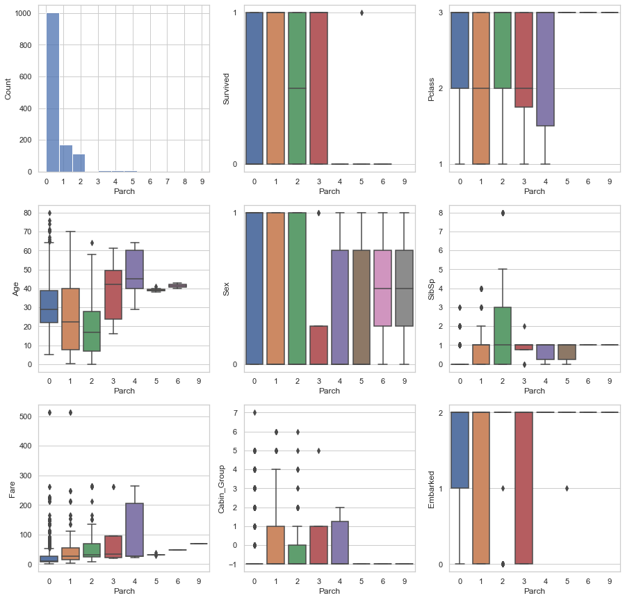
    


Parch has some relation with Age. It has certain characteristics. More Parent/Children means paying more to tickets.


```python
data_final = data_impute_dtree.copy()
data_final["Age"] = data_final["MF_Age"]
data_final = data_final.drop("MF_Age", axis=1)
data_final["Name"] = data_all["Name"]
data_final["Sex"] = data_all["Sex"]
data_final["Fare"] = data_all["Fare"]
```

#Feature Engineering

Pclass:


```python
#Pclass
fig,axes = plt.subplots(nrows=1, ncols=2, figsize=(10,5))
axes[1].yaxis.set_major_locator(MaxNLocator(integer=True))

axes[0].tick_params('x', labelrotation=60)
axes[1].tick_params('x', labelrotation=60)

sns.countplot(ax=axes[0], x="Pclass", data=data_final)
sns.boxplot(ax=axes[1], data=data_final, x="Pclass", y="Survived")

plt.show()
```


    
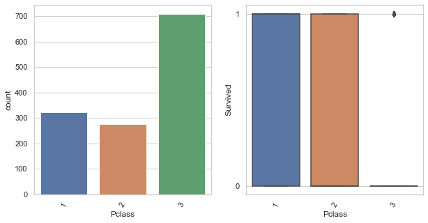
    


Pclass is a good feature to predict survival.

Name:


```python
data_final["Name"].head()
```


    0                              Braund, Mr. Owen Harris
    1    Cumings, Mrs. John Bradley (Florence Briggs Th...
    2                               Heikkinen, Miss. Laina
    3         Futrelle, Mrs. Jacques Heath (Lily May Peel)
    4                             Allen, Mr. William Henry
    Name: Name, dtype: string


```python
data_final["Title"] = [i.split(".")[0].split(",")[-1].strip() for i in data_final["Name"]]
```


```python
#plotting titles in the name
fig,axes = plt.subplots(nrows=1, ncols=2, figsize=(10,5))
axes[1].yaxis.set_major_locator(MaxNLocator(integer=True))

axes[0].tick_params('x', labelrotation=60)
axes[1].tick_params('x', labelrotation=60)

sns.countplot(ax=axes[0], x="Title", data=data_final)
sns.boxplot(ax=axes[1], data=data_final, x="Title", y="Survived")

plt.show()
```


    
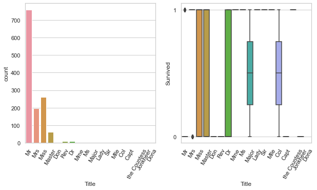
    


```python
data_final["Title"].unique()
```


    array(['Mr', 'Mrs', 'Miss', 'Master', 'Don', 'Rev', 'Dr', 'Mme', 'Ms',
           'Major', 'Lady', 'Sir', 'Mlle', 'Col', 'Capt', 'the Countess',
           'Jonkheer', 'Dona'], dtype=object)


```python
data_final["Title"] = data_final["Title"].replace(["Capt", "Col", "Don", "Dr", "Major", "Rev", "Sir", "Jonkheer"], "Rare_Male")
data_final["Title"] = data_final["Title"].replace(["Lady", "the Countess", "Dona", "Mme", "Ms", "Mlle"], "Rare_Female")

fig,axes = plt.subplots(nrows=1, ncols=2, figsize=(10,5))
axes[1].yaxis.set_major_locator(MaxNLocator(integer=True))

axes[0].tick_params('x', labelrotation=45)
axes[1].tick_params('x', labelrotation=45)

sns.countplot(ax=axes[0], x="Title", data=data_final)
sns.boxplot(ax=axes[1], data=data_final, x="Title", y="Survived")

plt.show()
```


    
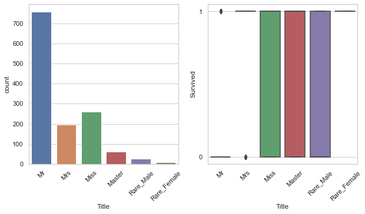
    


The title in the name gives good prediction of survival so we can use it.


```python
#converting titles to categories and discrete values
data_final["Title"] = data_final["Title"].astype('category')
title_categories = dict(enumerate(data_final["Title"].cat.categories))
data_final["Title"] = data_final["Title"].cat.codes
data_final["Title"]  =data_final["Title"].astype(int)

data_final.drop(labels=["Name"], axis=1, inplace=True)
data_final["Embarked"] = data_final["Embarked"].astype('category')

title_categories
```


    {0: 'Master', 1: 'Miss', 2: 'Mr', 3: 'Mrs', 4: 'Rare_Female', 5: 'Rare_Male'}


Sex:


```python
fig,axes = plt.subplots(nrows=1, ncols=2, figsize=(10,5))
axes[1].yaxis.set_major_locator(MaxNLocator(integer=True))

axes[0].tick_params('x', labelrotation=45)
axes[1].tick_params('x', labelrotation=45)

sns.countplot(ax=axes[0], x="Sex", data=data_final)
sns.boxplot(ax=axes[1], data=data_final, x="Sex", y="Survived")

plt.show()
```


    
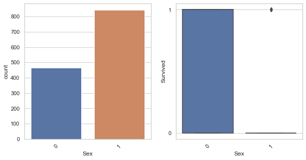
    


Sex of the people is a good feature to predict survival.

Age:


```python
fig,axes = plt.subplots(nrows=1, ncols=2, figsize=(30,15))
axes[1].yaxis.set_major_locator(MaxNLocator(integer=True))

axes[0].tick_params('x', labelrotation=90)
axes[1].tick_params('x', labelrotation=90)

sns.countplot(ax=axes[0], x="Age", data = data_final)
sns.scatterplot(ax=axes[1], data=data_final, x="Age", y="Survived",s=70)

plt.show()
```


    
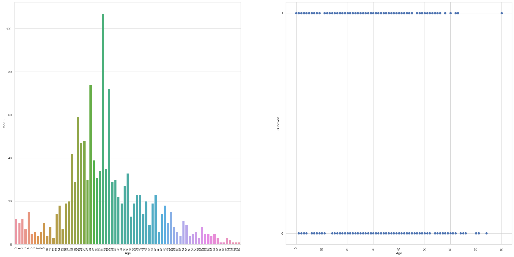
    


Age can be used to predict survival.

Parch+SibSp=Fmly_count:


```python
data_final["Fmly_Count"] = data_final["SibSp"] + data_final["Parch"] + 1

fig,axes = plt.subplots(nrows=1, ncols=2, figsize=(10,5))
axes[1].yaxis.set_major_locator(MaxNLocator(integer=True))

axes[0].tick_params('x', labelrotation=45)
axes[1].tick_params('x', labelrotation=45)

sns.countplot(ax=axes[0], x="Fmly_Count", data=data_final)
sns.boxplot(ax=axes[1], data=data_final, x="Fmly_Count", y="Survived")

plt.show()
```


    
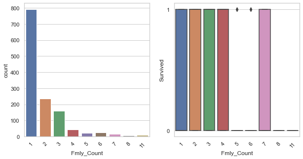
    


Fmly_count can be used to predict survival.

Fare:


```python
fig,axes = plt.subplots(nrows=1, ncols=2, figsize=(10,5))
axes[1].yaxis.set_major_locator(MaxNLocator(integer=True))

axes[0].tick_params('x', labelrotation=45)
axes[1].tick_params('x', labelrotation=45)

sns.histplot(ax=axes[0], x="Fare", data=data_final)
sns.scatterplot(ax=axes[1], data=data_final,x ="Fare",y="Survived")

plt.show()
```


    
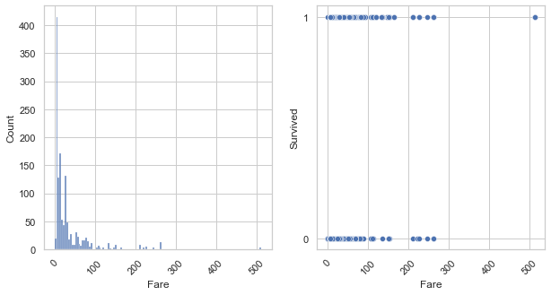
    


Fare can be used to predict

Cabin_group:


```python
fig,axes = plt.subplots(nrows=1, ncols=2, figsize=(10,5))
axes[1].yaxis.set_major_locator(MaxNLocator(integer=True))

axes[0].tick_params('x', labelrotation=45)
axes[1].tick_params('x', labelrotation=45)

sns.countplot(ax=axes[0], x="Cabin_Group", data=data_final)
sns.boxplot(ax=axes[1], data=data_final, x="Cabin_Group", y="Survived")

plt.show()
```


    
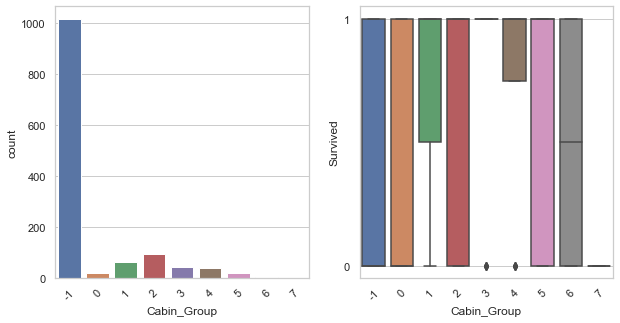
    


Cabin_group can be used for prediction

Embarked:


```python
fig,axes = plt.subplots(nrows=1, ncols=2, figsize=(10,5))
axes[1].yaxis.set_major_locator(MaxNLocator(integer=True))

axes[0].tick_params('x', labelrotation=45)
axes[1].tick_params('x', labelrotation=45)

sns.countplot(ax=axes[0], x="Embarked", data=data_final)
sns.boxplot(ax=axes[1], data=data_final, x="Embarked", y="Survived")

plt.show()
```


    
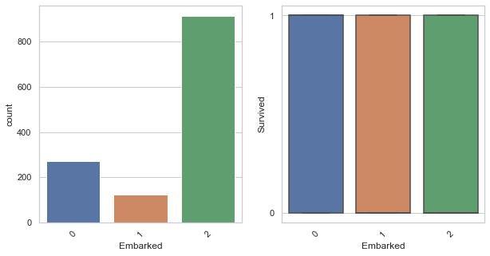
    


Embarked doesn't gives us some meaningful insight to predict

#Training and testing data


```python
#get dummies
data_final = pd.get_dummies(data_final, columns=["Pclass", "Title", "Sex", "Fmly_Count", "Cabin_Group", "Embarked"])
```


```python
#dropping unnecessary
data_final.drop(labels=['SibSp','Parch'],axis=1,inplace=True)
```


```python
data_final.head(5)
```


<div>

<table border="1" class="dataframe">
  <thead>
    <tr style="text-align: right;">
      <th></th>
      <th>Survived</th>
      <th>Age</th>
      <th>Fare</th>
      <th>Pclass_1</th>
      <th>Pclass_2</th>
      <th>Pclass_3</th>
      <th>Title_0</th>
      <th>Title_1</th>
      <th>Title_2</th>
      <th>Title_3</th>
      <th>...</th>
      <th>Cabin_Group_1</th>
      <th>Cabin_Group_2</th>
      <th>Cabin_Group_3</th>
      <th>Cabin_Group_4</th>
      <th>Cabin_Group_5</th>
      <th>Cabin_Group_6</th>
      <th>Cabin_Group_7</th>
      <th>Embarked_0</th>
      <th>Embarked_1</th>
      <th>Embarked_2</th>
    </tr>
  </thead>
  <tbody>
    <tr>
      <th>0</th>
      <td>0</td>
      <td>22</td>
      <td>7.25</td>
      <td>0</td>
      <td>0</td>
      <td>1</td>
      <td>0</td>
      <td>0</td>
      <td>1</td>
      <td>0</td>
      <td>...</td>
      <td>0</td>
      <td>0</td>
      <td>0</td>
      <td>0</td>
      <td>0</td>
      <td>0</td>
      <td>0</td>
      <td>0</td>
      <td>0</td>
      <td>1</td>
    </tr>
    <tr>
      <th>1</th>
      <td>1</td>
      <td>38</td>
      <td>71.2833</td>
      <td>1</td>
      <td>0</td>
      <td>0</td>
      <td>0</td>
      <td>0</td>
      <td>0</td>
      <td>1</td>
      <td>...</td>
      <td>0</td>
      <td>1</td>
      <td>0</td>
      <td>0</td>
      <td>0</td>
      <td>0</td>
      <td>0</td>
      <td>1</td>
      <td>0</td>
      <td>0</td>
    </tr>
    <tr>
      <th>2</th>
      <td>1</td>
      <td>26</td>
      <td>7.925</td>
      <td>0</td>
      <td>0</td>
      <td>1</td>
      <td>0</td>
      <td>1</td>
      <td>0</td>
      <td>0</td>
      <td>...</td>
      <td>0</td>
      <td>0</td>
      <td>0</td>
      <td>0</td>
      <td>0</td>
      <td>0</td>
      <td>0</td>
      <td>0</td>
      <td>0</td>
      <td>1</td>
    </tr>
    <tr>
      <th>3</th>
      <td>1</td>
      <td>35</td>
      <td>53.1</td>
      <td>1</td>
      <td>0</td>
      <td>0</td>
      <td>0</td>
      <td>0</td>
      <td>0</td>
      <td>1</td>
      <td>...</td>
      <td>0</td>
      <td>1</td>
      <td>0</td>
      <td>0</td>
      <td>0</td>
      <td>0</td>
      <td>0</td>
      <td>0</td>
      <td>0</td>
      <td>1</td>
    </tr>
    <tr>
      <th>4</th>
      <td>0</td>
      <td>35</td>
      <td>8.05</td>
      <td>0</td>
      <td>0</td>
      <td>1</td>
      <td>0</td>
      <td>0</td>
      <td>1</td>
      <td>0</td>
      <td>...</td>
      <td>0</td>
      <td>0</td>
      <td>0</td>
      <td>0</td>
      <td>0</td>
      <td>0</td>
      <td>0</td>
      <td>0</td>
      <td>0</td>
      <td>1</td>
    </tr>
  </tbody>
</table>
<p>5 rows × 35 columns</p>
</div>


Next we will be splitting the test data and training data as the original.


```python
#splitting of testing and training data
train_data = data_final[:len_train]
test_data = data_final[len_train:]

train_data.info()
```

    <class 'pandas.core.frame.DataFrame'>
    RangeIndex: 891 entries, 0 to 890
    Data columns (total 35 columns):
     #   Column          Non-Null Count  Dtype  
    ---  ------          --------------  -----  
     0   Survived        891 non-null    Int64  
     1   Age             891 non-null    int64  
     2   Fare            891 non-null    Float64
     3   Pclass_1        891 non-null    uint8  
     4   Pclass_2        891 non-null    uint8  
     5   Pclass_3        891 non-null    uint8  
     6   Title_0         891 non-null    uint8  
     7   Title_1         891 non-null    uint8  
     8   Title_2         891 non-null    uint8  
     9   Title_3         891 non-null    uint8  
     10  Title_4         891 non-null    uint8  
     11  Title_5         891 non-null    uint8  
     12  Sex_0           891 non-null    uint8  
     13  Sex_1           891 non-null    uint8  
     14  Fmly_Count_1    891 non-null    uint8  
     15  Fmly_Count_2    891 non-null    uint8  
     16  Fmly_Count_3    891 non-null    uint8  
     17  Fmly_Count_4    891 non-null    uint8  
     18  Fmly_Count_5    891 non-null    uint8  
     19  Fmly_Count_6    891 non-null    uint8  
     20  Fmly_Count_7    891 non-null    uint8  
     21  Fmly_Count_8    891 non-null    uint8  
     22  Fmly_Count_11   891 non-null    uint8  
     23  Cabin_Group_-1  891 non-null    uint8  
     24  Cabin_Group_0   891 non-null    uint8  
     25  Cabin_Group_1   891 non-null    uint8  
     26  Cabin_Group_2   891 non-null    uint8  
     27  Cabin_Group_3   891 non-null    uint8  
     28  Cabin_Group_4   891 non-null    uint8  
     29  Cabin_Group_5   891 non-null    uint8  
     30  Cabin_Group_6   891 non-null    uint8  
     31  Cabin_Group_7   891 non-null    uint8  
     32  Embarked_0      891 non-null    uint8  
     33  Embarked_1      891 non-null    uint8  
     34  Embarked_2      891 non-null    uint8  
    dtypes: Float64(1), Int64(1), int64(1), uint8(32)
    memory usage: 50.6 KB

We will be using 'standard scaler' from sklearn library to scale the data.


```python
x_train=train_data.drop('Survived',axis=1)
from sklearn.preprocessing import StandardScaler
x_train = StandardScaler().fit_transform(x_train)
#y_train=pd.DataFrame( train_data["Survived"])
#y_train=y_train.to_records()
y_train = train_data["Survived"]
y_train = y_train.astype('int')


```


```python
print(y_train)
```

    0      0
    1      1
    2      1
    3      1
    4      0
          ..
    886    0
    887    1
    888    0
    889    1
    890    0
    Name: Survived, Length: 891, dtype: int64

Next we create validation set from our training data to calculate the accuracy of the model. Validation set is a part of training data which is used as testing data to calculate accuracy.


```python
from sklearn.model_selection import train_test_split
x_train, x_test, y_train, y_test = train_test_split(StandardScaler().fit_transform(x_train), y_train, test_size=0.33, random_state=42)
```
First we will be using K-Nearest Neighbour(KNN) ML model on our input features and calculate its accuracy on validation set. 

#Prediction using KNN


```python

from sklearn.neighbors import KNeighborsClassifier
from sklearn.metrics import classification_report
from sklearn.metrics import confusion_matrix

knn_mod = KNeighborsClassifier()
knn_mod.fit(x_train,y_train)

y_prediction_train=knn_mod.predict(x_train)
y_prediction_test=knn_mod.predict(x_test)

a=confusion_matrix(y_train,y_prediction_train)
print(a)
# outcome values order in sklearn
tp, fn, fp, tn =a.reshape(-1)
print('Outcome values : \n', tp, fn, fp, tn)
# classification report for precision, recall f1-score and accuracy
matrix = classification_report(y_train,y_prediction_train,labels=[1,0])
print('Classification report : \n',matrix)

b=confusion_matrix(y_test,y_prediction_test)
print(b)
# outcome values order in sklearn
tp, fn, fp, tn =b.reshape(-1)
print('Outcome values : \n', tp, fn, fp, tn)
# classification report for precision, recall f1-score and accuracy
matrix = classification_report(y_test,y_prediction_test,labels=[1,0])
print('Classification report : \n',matrix)

```

    [[350  24]
     [ 57 165]]
    Outcome values : 
     350 24 57 165
    Classification report : 
                   precision    recall  f1-score   support
    
               1       0.87      0.74      0.80       222
               0       0.86      0.94      0.90       374
    
        accuracy                           0.86       596
       macro avg       0.87      0.84      0.85       596
    weighted avg       0.86      0.86      0.86       596
    
    [[148  27]
     [ 39  81]]
    Outcome values : 
     148 27 39 81
    Classification report : 
                   precision    recall  f1-score   support
    
               1       0.75      0.68      0.71       120
               0       0.79      0.85      0.82       175
    
        accuracy                           0.78       295
       macro avg       0.77      0.76      0.76       295
    weighted avg       0.77      0.78      0.77       295
    

Here we can see that the training accuracy of our model is 86% and the testing accuracy is 78%. Next we will be considering another ML model called Logistic Regression on our data to check whether it is better that KNN or not.


#Prediction using logistic regression


```python
from sklearn.linear_model import LogisticRegression
from sklearn.metrics import accuracy_score

logreg = LogisticRegression()
logreg.fit(x_train, y_train)

accuracy_train = round(logreg.score(x_train, y_train) * 100, 2) 
accuracy_test = round(logreg.score(x_test, y_test) * 100, 2)

print("Training Accuracy: % {}".format(accuracy_train))
print("Testing Accuracy: % {}".format(accuracy_test))


y_prediction_train=logreg.predict(x_train)
y_prediction_test=logreg.predict(x_test)

a=confusion_matrix(y_train,y_prediction_train)
print(a)
# outcome values order in sklearn
tp, fn, fp, tn =a.reshape(-1)
print('Outcome values : \n', tp, fn, fp, tn)
# classification report for precision, recall f1-score and accuracy
matrix = classification_report(y_train,y_prediction_train,labels=[1,0])
print('Classification report : \n',matrix)

b=confusion_matrix(y_test,y_prediction_test)
print(b)
# outcome values order in sklearn
tp, fn, fp, tn =b.reshape(-1)
print('Outcome values : \n', tp, fn, fp, tn)
# classification report for precision, recall f1-score and accuracy
matrix = classification_report(y_test,y_prediction_test,labels=[1,0])
print('Classification report : \n',matrix)


```

    Training Accuracy: % 85.23
    Testing Accuracy: % 83.73
    [[335  39]
     [ 49 173]]
    Outcome values : 
     335 39 49 173
    Classification report : 
                   precision    recall  f1-score   support
    
               1       0.82      0.78      0.80       222
               0       0.87      0.90      0.88       374
    
        accuracy                           0.85       596
       macro avg       0.84      0.84      0.84       596
    weighted avg       0.85      0.85      0.85       596
    
    [[154  21]
     [ 27  93]]
    Outcome values : 
     154 21 27 93
    Classification report : 
                   precision    recall  f1-score   support
    
               1       0.82      0.78      0.79       120
               0       0.85      0.88      0.87       175
    
        accuracy                           0.84       295
       macro avg       0.83      0.83      0.83       295
    weighted avg       0.84      0.84      0.84       295
    

Now we can see that the training accuracy is 85% and the testing accuracy is 84%. We can clearly see that, logistic regression model is more accurate than KNN model on testing data. So we will be using logistic regression model to predict the survival of the passengers in test.csv


```python
#prediction by sklearn
x_test1 = test_data.drop("Survived", axis=1)
x_test1 = StandardScaler().fit_transform(x_test1)

y_predict=logreg.predict(x_test1)
test_data["Survived"] = y_predict.tolist()

test_data = pd.read_csv('/Users/sam/Documents/ML/test.csv')
test_data.set_index("PassengerId")
test_data["Survived"] = y_predict.tolist()
test_data[["PassengerId","Survived"]].to_csv("submission1.csv", index=False)
```

    /var/folders/l2/tq_sfhyj76988knrq9ghdflm0000gn/T/ipykernel_2504/2294351978.py:6: SettingWithCopyWarning: 
    A value is trying to be set on a copy of a slice from a DataFrame.
    Try using .loc[row_indexer,col_indexer] = value instead
    
    See the caveats in the documentation: https://pandas.pydata.org/pandas-docs/stable/user_guide/indexing.html#returning-a-view-versus-a-copy
      test_data["Survived"] = y_predict.tolist()

We will store the predicted output in submission1.csv, which will have passenger id and the prediction of their survival.


```python
df=pd.read_csv("/Users/sam/Documents/ML/submission1.csv")
df.head(100)
```


<div>
<table border="1" class="dataframe">
  <thead>
    <tr style="text-align: right;">
      <th></th>
      <th>PassengerId</th>
      <th>Survived</th>
    </tr>
  </thead>
  <tbody>
    <tr>
      <th>0</th>
      <td>892</td>
      <td>0</td>
    </tr>
    <tr>
      <th>1</th>
      <td>893</td>
      <td>0</td>
    </tr>
    <tr>
      <th>2</th>
      <td>894</td>
      <td>0</td>
    </tr>
    <tr>
      <th>3</th>
      <td>895</td>
      <td>0</td>
    </tr>
    <tr>
      <th>4</th>
      <td>896</td>
      <td>1</td>
    </tr>
    <tr>
      <th>...</th>
      <td>...</td>
      <td>...</td>
    </tr>
    <tr>
      <th>95</th>
      <td>987</td>
      <td>0</td>
    </tr>
    <tr>
      <th>96</th>
      <td>988</td>
      <td>1</td>
    </tr>
    <tr>
      <th>97</th>
      <td>989</td>
      <td>0</td>
    </tr>
    <tr>
      <th>98</th>
      <td>990</td>
      <td>1</td>
    </tr>
    <tr>
      <th>99</th>
      <td>991</td>
      <td>0</td>
    </tr>
  </tbody>
</table>
<p>100 rows × 2 columns</p>
</div>


